# campus

#### 介绍
校园互助平台，运用IntelliJ IDEA 2021.1.3开发环境、MySQL数据库、Elasticsearch搜索引擎设计开发的一个基于SpringBoot的校园互助平台。主要用于同学间的互相帮助。该网站由五个功能模块和一个主页组成，五个功能模块分别为互助模块、需求模块、代送模块、留言模块、后台管理模块。互助模块是将不属于自己的商品展示，用户选择商品进行代送；需求模块是用户在互助模块发布的商品信息，提供确认收货、评分、查看代送状态、同意取消代送和修改需求商品等功能；代送模块是在互助模块由用户点击代送，进行商品代送信息模块，包含取消代送、已送达等按钮；留言模块是用户在该网站问题反馈或者是反馈在网站遇到问题；后台管理模块是管理员登陆后跳转到的模块，管理模块可以对用户管理，对管理员管理，对留言管理，对商品管理和图形化界面展示。

#### 软件架构

  

#### 使用说明

功能模块分析  
 **登录**   
    根据登录账号的不同跳转到主界面或者后台管理界面，对输入的格式进行判断，格式正确则进入后台进行数据库比对，比对成功如果是用户则跳转到主页，如果是管理员则跳转到管理员界面，失败则返回False到登陆界面，进行提示。  
 **注册**   
    根据手机号进行注册，填写手机号，姓名，密码，格式正确则发送Axios请求到后台，后台将数据添加到数据库，在数据库中手机号采用字段唯一索引，因此手机号不能重复，如果成功插入数据库则注册成功返回True并跳转到登陆界面，失败则返回False到注册界面，进行提示。  
 **主页**   
    首先是右上角的导航菜单，正中间采用轮播图，美化主页，以及一些互助标语，和一些对内部界面跳转的按钮，下方有一个互助商品的展示，展示互助的订单，提供给访客浏览，以及点击切换商品，将没有代送出去的商品循环展示，最下方是网站的页脚，包含跳转链接和一些网站信息，以及网站管理人的联系方式。  
 **互助界面**   
    该界面采用Vue框架和Element UI构建，将数据库商品代送字段为未代送状态的数据传输到虚拟机，虚拟机采用Linux的系统，因为Linux是多用户多进程系统，Windows是单用户伪多用户系统，不适合服务器；然后，互联网开放，Linux也是开放的，像Apache这样的开放软件优先在Linux上实现[8]。该网站采用在虚拟机中建立一个Linux系统，使用FinalShell对虚拟机操作；在虚拟机中建立Docker容器，因为Docker是一个快速交付应用、运行应用的技术:1.可以将程序及其依赖、运行环境一起打包为一个镜像,可以迁移到任意Linux操作系统[9]；2.运行时利用沙箱机制形成隔离容器，各个应用互不干扰；3.启动、移除都可以通过一行命令完成，方便快捷。在Docker官网拉取Kibana 7.0.12和Elasticsearch 7.0.12在Docker容器中建立Kibana和Elasticsearch，访问GitHub为Elasticsearch添加中文分词器和拼英分词器，访问Kibana暴露的外部的端口，进入Kibana开发者界面，创建索引库，后台代码通过RestClient对虚拟机中的Elasticsearch进行文档操作。访问互助界面时，直接通过网关访问虚拟机的Elasticsearch文档，返回到该界面。该界面还提供给用户添加需求商品按钮，跳转到添加商品界面。  
 **代送订单**   
    代送用户默认都是不可代送，原理是在数据库定义一个能否代送字段，只有在后端管理界面管理员打开用户代送开关才可以代送，用户在互助界面有代送资格的用户点击代送的订单都会展示在该界面，该界面提供取消代送和已送达按钮，实时更新商品的代送状态。  
 **需求订单**   
    用户在互助界面添加的需求商品展示在该界面，未代送和代送的订单提供修改按钮，已送达的商品提供收货按钮，代送人点击送达并且被代送人点击收货即交易完成，点击确认收货则会在收货下方弹出评分对话，滑动进行星级选择，点击提交为代送人评分；代送人如果选择取消代送，则需要被代送人在被代送人的需求订单界面点击同意取消，则会将商品重新回归到未代送阶段，重新上传到虚拟机的Elasticsearch文档中。  
 **留言**   
    用户登陆后，该界面自动填写用户登陆的姓名和电话，方便用户提交，留言模块用于用户遇到网站问题或者网站出现漏洞，用户反馈界面，更好的提高网站的稳定性。  
 **后台管理界面**   
    后台管理主页：采用聚集函数将一些数据统计展示，在界面中调用ECharts统计最近七天的代送量和已送达量对比，用折线图和柱状图展示，更直观的了解商品交易信息。用户管理：展示所有用户信息，提供手机号模糊搜索，用户修改按钮，以及分页处理。管理员管理：展示所有管理员信息，提供管理员id模糊搜索、分页、管理员编辑、删除、新增按钮，新增则是弹出新增弹出框，进行数据的插入。商品信息：展示所有商品的信息，查看详情、删除按钮、分页，查看详情是弹窗形式进行修改。留言：展示用户留言信息。  

#### 界面展示  
 **登录界面**   
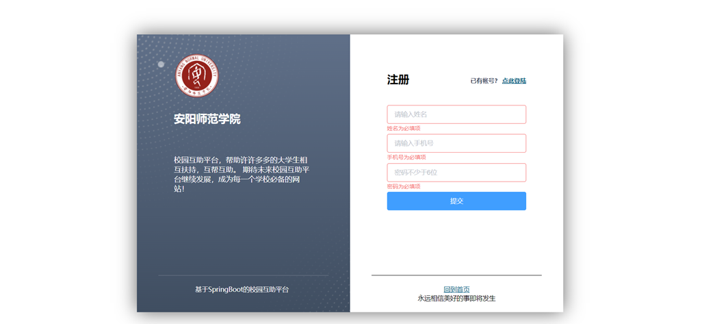  
 **校园互助平台主界面**  
 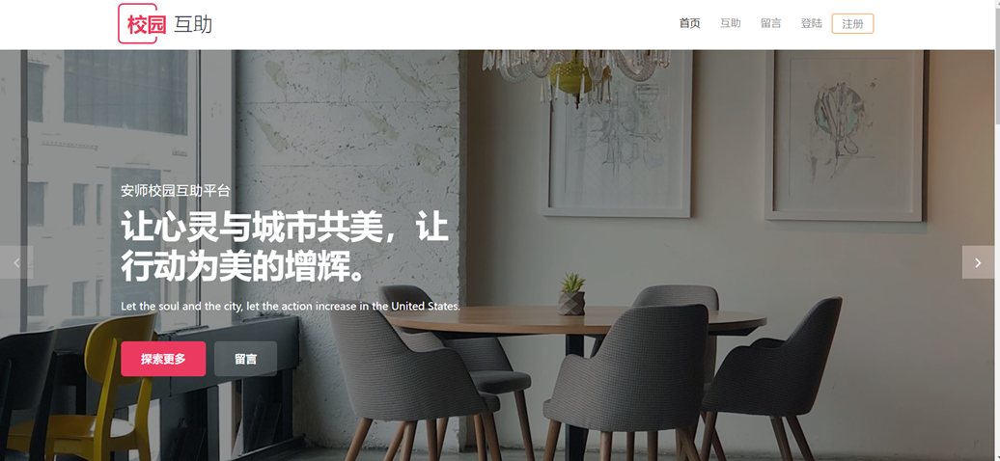  
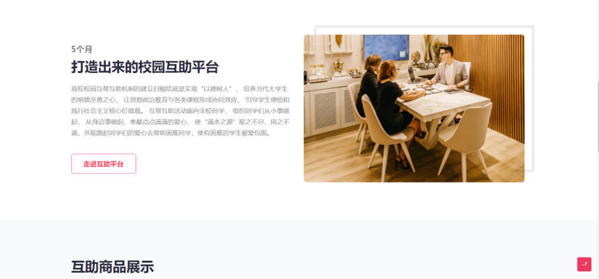  
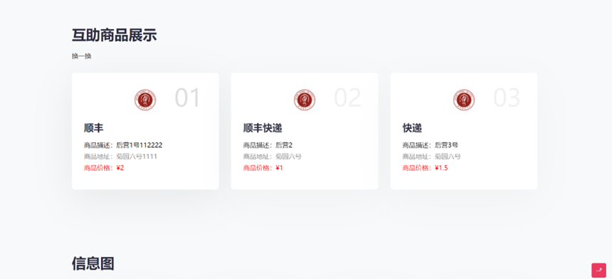  
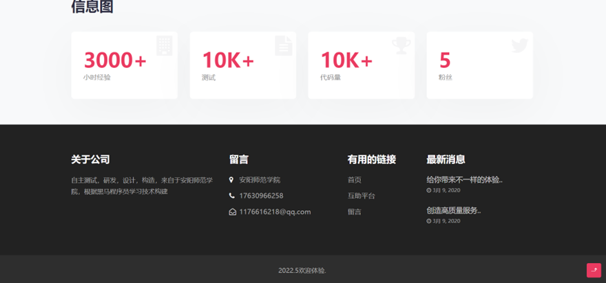  
 **互帮互助界面**    
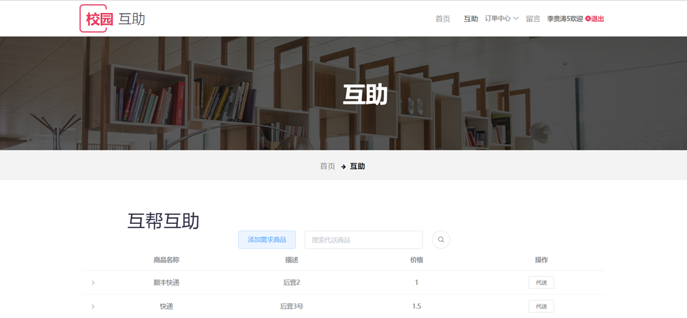  
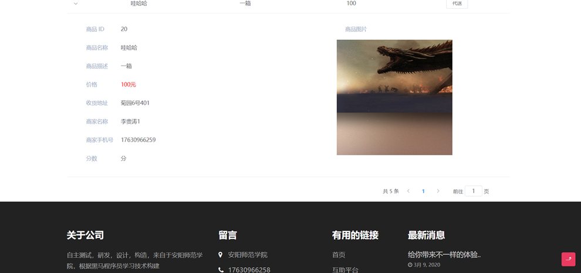  
 **代送订单**   
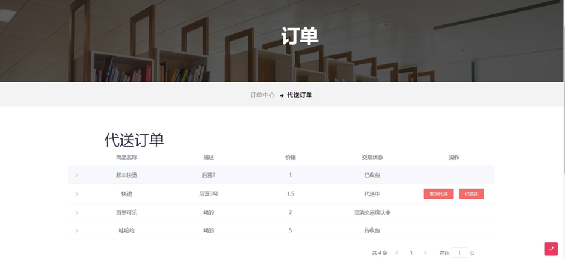  
 **需求订单**   
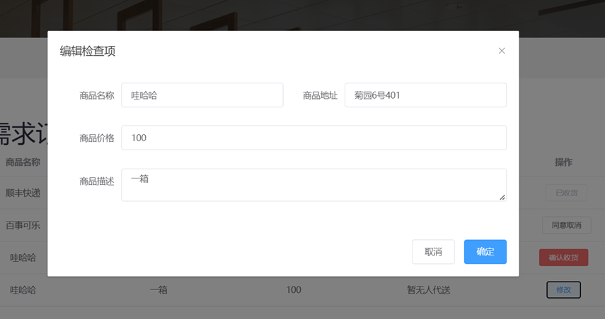  
 **评分按钮**     
  
 **留言界面**   
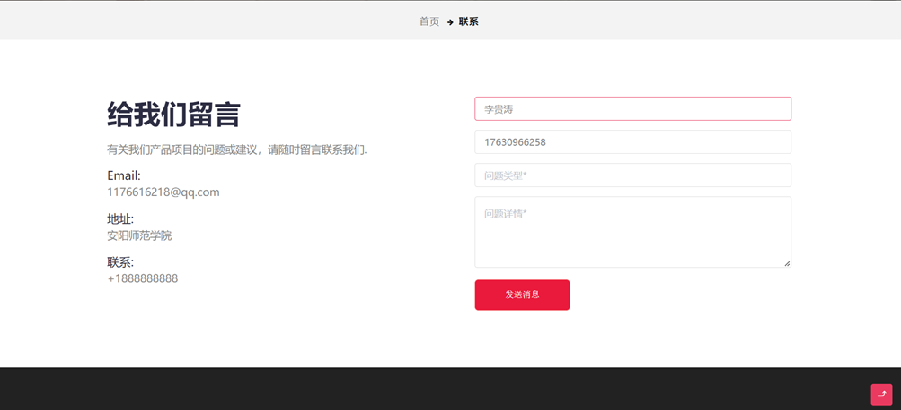  
 **后台管理主界面**   
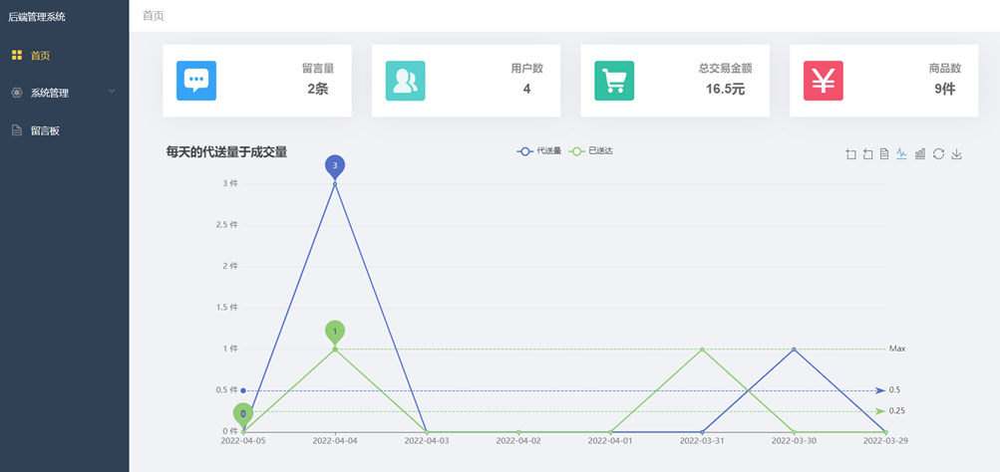  
 **后台用户管理界面**   
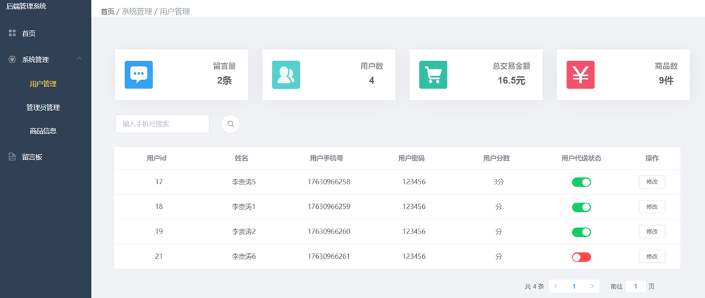  

